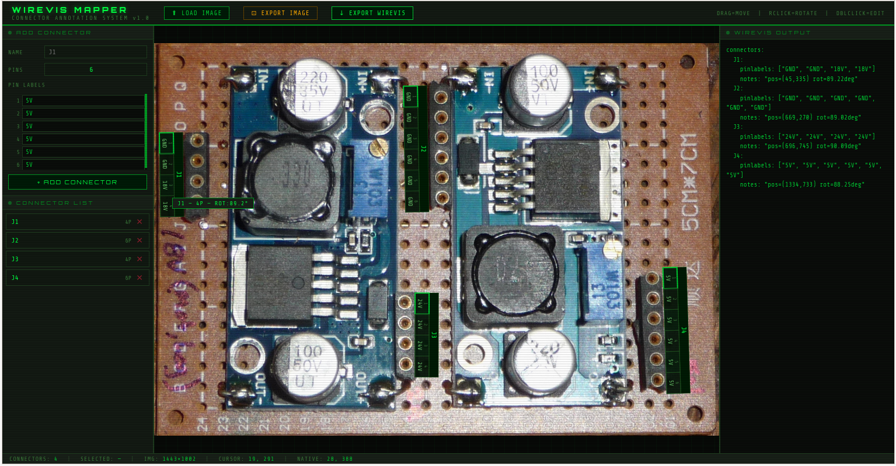
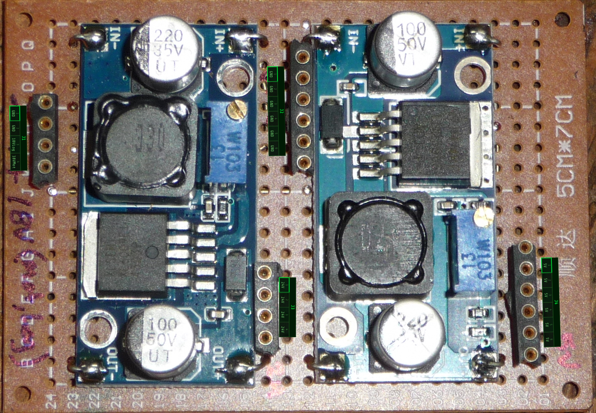
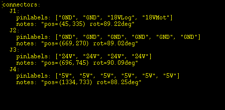

# wireVis Pin Mapper

A single-file, browser-based tool for annotating PCB images with connector overlays and generating the `connectors:` section of a [wireVis](https://github.com/ruenahcmohr) wiring diagram file.



---

## Overview

When documenting a robot or embedded system built from multiple circuit modules, you need two things: a visual reference showing where each connector lives on a board, and a machine-readable description of what each pin does. This tool produces both at the same time.

You load a photo or render of your PCB, place labeled connector strips directly over the image, and export either an annotated PNG (for visual reference) or a `.wirevis` text fragment (to drop into your inter-module wiring diagram).

No installation required — open `wirevis_mapper-V2.html` in any modern browser and go.

---

## Workflow

1. **Load your image** — click **LOAD IMAGE** or drag and drop a photo or render of your PCB onto the canvas. The image is automatically scaled to fit the available space.

2. **Define a connector** — in the left panel, set the connector name (e.g. `J1`), dial in the pin count with the spinner, and fill in a label for each pin.

3. **Add it to the canvas** — click **ADD CONNECTOR**. The connector strip appears over the image, centred by default.

4. **Position and orient** — drag the strip with the **left mouse button** to move it; drag with the **right mouse button** to rotate it. Hold **Shift** while rotating to snap to 15° increments. Double-click a connector to rename it or edit its pin labels.

5. **Export the image** — click **EXPORT IMAGE** to download a PNG of the original image with all connector overlays composited at native resolution and correctly scaled.

6. **Export the wireVis fragment** — click **EXPORT WIREVIS** to download a `.wirevis` text file containing the `connectors:` section, ready to paste into your wiring diagram.

> **Note:** a mouse is required for rotate. There is currently no scale option for the connector strips.

---

## Output format

The exported wireVis fragment covers only the `connectors:` section. Each connector entry contains a `pinlabels` list and a `notes` field recording its position and rotation in native image pixel coordinates (not the scaled screen view).

```yaml
connectors:
  J1:
    pinlabels: ["GND", "3V3", "SDA", "SCL"]
    notes: "pos=(412,830) rot=0.0deg"
  J2:
    pinlabels: ["VIN", "GND", "TX", "RX", "CTS", "RTS"]
    notes: "pos=(215,1044) rot=90.0deg"
```

Use this fragment as the starting point for building a full wireVis inter-module wiring diagram.

---

## Example output

Annotated image export:



wireVis text block:



---

## Files

| File | Description |
|---|---|
| `wirevis_mapper-V2.html` | The tool — open this in a browser |
| `wirevis_mapper_dd.txt` | The original design prompt used to generate the tool |
| `screenshot.png` | UI screenshot |
| `wirevis_annotated.png` | Example annotated image export |
| `textblock.png` | Example wireVis text output |
| `example1/` | Example project files |

---

## Notes & known limitations

- The wireVis output is **write-only** — the tool does not currently parse an existing `.wirevis` file to reconstruct a previous session. Reload support may be added in a future revision.
- Connector strip size is fixed; there is no scale control.
- Coordinates in the `notes` field are always in **native image pixels**, regardless of how the image is scaled on screen.

---

## Acknowledgements

The tool was generated using Claude (Anthropic) from the design prompt in `wirevis_mapper_dd.txt`, with a subsequent fix for export scaling. Feel free to take and modify this project — only about 10 minutes went into writing the prompt.
