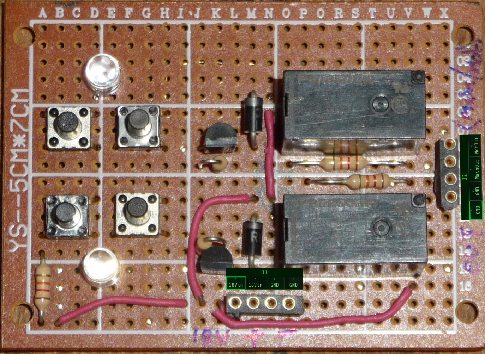

# WireVis-PCB pin mapper
One-file webpage to generate image overlays and wireVis fragments for PCBs

The included prompt was compiled with claude.
The goal of this tool is to build connection documentation for something like a robot that 
consists of multiple circuit modules. As well as helping generate the pinout graphics, it
generates the connectors section of a wireVis file that you can build the inter-circuit
charts with.

The prompt is slightly modfied as the first pass contained a bug where the overlays in the 
export were not properly scaled. There was an intent to be able to use the text block to 
reload the graphVis data and reconstruct the overlays. I may try to modify this in the future
but as it stands, I think the write-only satisfies my needs.

Please feel free to take and modify this project, I only put about 10 minutes into building 
the prompt. 

workflow
---------

- load a trimmed, clean image of your PCB/module into the page

- on the left side, dial the 'pins' to the count of a connector

- enter the names of the pins on the connector

- click 'add connector' 

- use a left click to position the label overlays and a right click to rotate them (haha! you need a mouse! :P )
 I'm sorry, there is no scale option. 
 
- export the image, keep as connector loations ref.

- export the wirevis text, use this to build your inter-module wiring diagram. 

